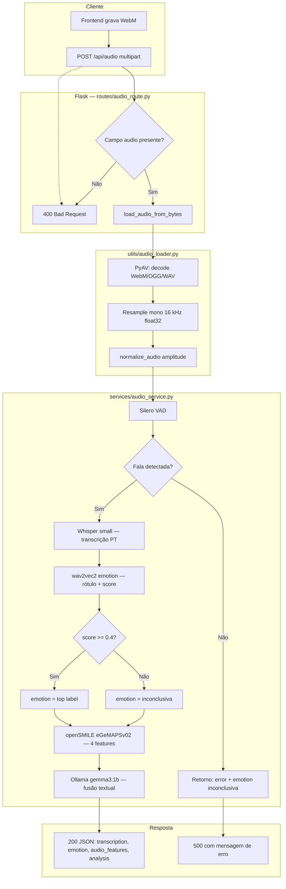
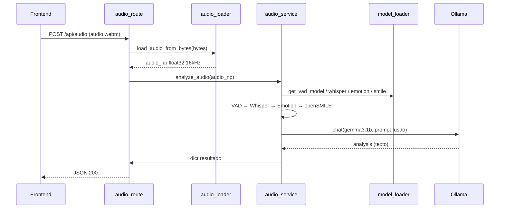
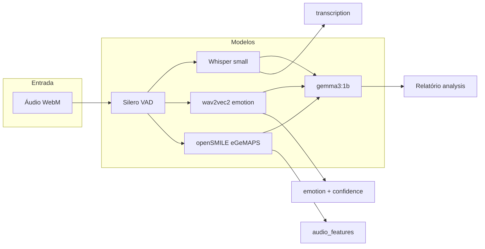

# Backend — Análise de Áudio para Acompanhamento Clínico

API Flask que recebe um arquivo de áudio (geralmente WebM gravado no navegador), processa o sinal com vários modelos de machine learning e devolve transcrição, emoção vocal, características acústicas e um relatório textual gerado por LLM.

> **Aviso:** este sistema é **auxiliar**. Não realiza diagnóstico médico. A saída da LLM é instruída a evitar conclusões clínicas e termos técnicos na resposta final.

---

## Índice

1. [Visão geral](#visão-geral)
2. [Fluxo do pipeline (Mermaid)](#fluxo-do-pipeline-mermaid)
3. [Arquitetura do código](#arquitetura-do-código)
4. [Modelos e componentes](#modelos-e-componentes)
5. [API HTTP](#api-http)
6. [Formato da resposta](#formato-da-resposta)
7. [Requisitos e ambiente](#requisitos-e-ambiente)
8. [Como executar](#como-executar)
9. [Variáveis de ambiente](#variáveis-de-ambiente)
10. [Cache e armazenamento](#cache-e-armazenamento)
11. [Limitações conhecidas](#limitações-conhecidas)

---

## Visão geral

O backend implementa um **pipeline multimodal** sobre áudio de voz:

| Etapa | Ferramenta | O que faz na prática |
|-------|------------|-----------------------|
| Preparação do Áudio | PyAV | Recebe o áudio do navegador e ajusta o formato e o volume para as inteligências artificiais entenderem. |
| Filtragem de Voz | Silero VAD | Confirma se há voz humana no áudio (descarta trechos de silêncio ou apenas com ruídos). |
| Transcrição | Faster-Whisper | Transcreve exatamente as palavras que foram ditas no áudio para formato de texto. |
| Detecção de Emoção | Wav2Vec2 | Analisa o tom da voz para identificar a emoção predominante (como alegria, tristeza, irritação ou neutralidade). |
| Análise Acústica | openSMILE | Mede características físicas da voz, como intensidade (volume), estabilidade e variações de tom. |
| Relatório Clínico | Ollama (Gemma 3) | Junta todas as informações acima e redige um resumo humanizado e claro do estado do paciente. |

---

## Fluxo do pipeline (Mermaid)



### Sequência simplificada (temporal)



---

## Arquitetura do código

```
backend/
├── app.py                    # Flask app, CORS, cache HF, load_models no __main__
├── entrypoint.sh             # Docker: pip, espera Ollama, pull gemma3:1b
├── Dockerfile
├── requirements.txt
├── model_cache/              # Download Hugging Face / Whisper (gitignored)
├── routes/
│   └── audio_route.py        # POST /api/audio — validação HTTP e JSON
├── services/
│   └── audio_service.py      # Pipeline completo de análise
└── utils/
    ├── audio_loader.py       # PyAV decode + normalização
    └── model_loader.py       # Singleton dos modelos + ensure_ollama_model
```

| Camada | Responsabilidade |
|--------|------------------|
| `routes/` | Protocolo HTTP, status codes, serialização JSON |
| `services/` | Orquestração do pipeline ML e prompt da LLM |
| `utils/` | I/O de áudio e ciclo de vida dos modelos |

Os modelos são carregados **uma vez** (`load_models()`), com `threading.Lock`, na primeira requisição ou ao iniciar `python app.py`.

---

## Modelos e componentes

### 1. PyAV — decodificação de áudio (não é modelo ML)

| Item | Detalhe |
|------|---------|
| **Pacote** | `av==12.1.0` |
| **Onde** | `utils/audio_loader.py` → `load_audio_from_bytes()` |
| **Na prática** | O navegador envia um arquivo de som (geralmente WebM). Essa ferramenta traduz esse arquivo para um formato padronizado e "limpo" que as IAs conseguem ler. |
| **Responsabilidade** | Ler bytes → frames de áudio → **mono**, **16 kHz**, `float32`. |
| **Saída** | `numpy.ndarray` 1D |

Após o decode, `normalize_audio()` divide pelo pico absoluto para estabilizar amplitude entre gravações.

---

### 2. Silero VAD — detecção de atividade de voz

| Item | Detalhe |
|------|---------|
| **Modelo** | [Silero VAD](https://github.com/snakers4/silero-vad) (via `silero-vad==5.1.2`) |
| **Carregamento** | `load_silero_vad()` em `model_loader.py` |
| **Uso** | `get_speech_timestamps(audio_np, vad_model, sampling_rate=16000)` |
| **Na prática** | Evita que o sistema tente analisar um áudio de microfone mutado ou contendo apenas barulho de vento. Reduz custos de processamento e resultados falsos. |
| **Responsabilidade** | Responder: *existe voz humana neste áudio?* |
| **Se falhar** | Retorno antecipado amigável indicando que não foi detectada fala. |

O VAD **não corta** o áudio antes do Whisper; apenas valida presença de fala. A transcrição usa o áudio completo.

---

### 3. Faster-Whisper `small` — transcrição (ASR)

| Item | Detalhe |
|------|---------|
| **Modelo** | `small` ([Systran/faster-whisper-small](https://huggingface.co/Systran/faster-whisper-small)) |
| **Biblioteca** | `faster-whisper==1.0.3` |
| **Configuração** | Otimizado para rodar de forma leve e rápida em português. |
| **Na prática** | Escuta o áudio e escreve exatamente o que foi dito. Essa transcrição é fundamental para comparar se o "conteúdo" da fala bate com a "emoção" da voz. |
| **Responsabilidade** | Gerar a **transcrição textual** da gravação. |
| **Saída** | `transcription` (texto da fala) |

O Whisper não classifica emoção; apenas converte fala em texto.

---

### 4. Wav2Vec2 Emotion — classificação emocional da voz

| Item | Detalhe |
|------|---------|
| **Modelo** | `wav2vec2-large-robust-12-ft-emotion-msp-dim` |
| **Biblioteca** | `transformers` |
| **Na prática** | Ele ignora o *quê* está sendo dito e presta atenção *em como* está sendo dito. Analisando o tom de voz, ele determina se a pessoa soa triste, feliz, irritada ou neutra. |
| **Responsabilidade** | Estimar a **emoção predominante** e o nível de confiança (score) dessa conclusão. |
| **Regra de negócio** | Se o sinal for ambíguo (confiança menor que 40%), marcamos como "inconclusiva". |
| **Saída** | Rótulo da emoção e porcentagem de confiança. |

Os rótulos exatos dependem do cabeçalho do modelo no Hugging Face (ex.: dimensões arousal/valence ou classes agregadas). O código usa o item de **maior score** do pipeline.

---

### 5. openSMILE eGeMAPSv02 — características acústicas (prosódia)

| Item | Detalhe |
|------|---------|
| **Ferramenta** | `opensmile==2.6.0` |
| **Feature set** | `eGeMAPSv02` (extended Geneva Minimalistic Acoustic Parameter Set) |
| **Nível** | `Functionals` (estatísticas agregadas no trecho inteiro) |
| **Por quê** | Features **interpretáveis** e usadas em pesquisa de paralinguística — complementam emoção “black-box” do Wav2Vec2 com medidas de intensidade, tom e timbre. |
| **Responsabilidade** | Extrair descritores numéricos enviados **apenas ao prompt da LLM** (não expostos diretamente ao usuário final nas regras do prompt). |

| Feature extraída | Coluna openSMILE | Significado aproximado |
|------------------|------------------|-------------------------|
| Intensidade vocal | `loudness_sma3_amean` | Energia / “volume” médio da voz |
| Tom / altura | `F0semitoneFrom27.5Hz_sma3nz_amean` | Fundamental (F0) em semitons — proxy de tom |
| Padrão espectral | `mfcc1_sma3_amean` | 1º MFCC — timbre / qualidade do tracto vocal |
| Estabilidade / espectro | `alphaRatioV_sma3nz_amean` | Relação energia baixa/alta frequência na voz |

Valores ficam em `audio_features` no JSON de resposta (úteis para debug/API); o prompt da LLM é instruído a **não repetir números** no texto `analysis`.

---

### 6. Ollama `gemma3:1b` — fusão e relatório em linguagem natural

| Item | Detalhe |
|------|---------|
| **Modelo** | `gemma3:1b` (Google Gemma 3, via [Ollama](https://ollama.com)) |
| **Cliente** | `ollama==0.6.0` |
| **Na prática** | Recebe todos os dados isolados gerados anteriormente (o texto transcrito, o rótulo de emoção, as variações de tom) e funciona como um "tradutor" clínico. Ele escreve o relatório final empático e humanizado. |
| **Responsabilidade** | Realizar a **síntese final** cruzando transcrição, emoção e acústica, focando na coerência dos dados e removendo métricas técnicas para o leitor final. |
| **Restrições de Prompt** | Foi estritamente instruído a **não fazer diagnósticos médicos**, não exibir números e manter um tom de anotação clínica. |
| **Regras no user prompt** | Proibir diagnósticos, números, markdown, emojis; obrigar estrutura numerada 1–4 + disclaimer final |

A LLM **não reexecuta** ML: apenas interpreta os outputs já calculados.

---

### 7. Modelo carregado mas não usado no pipeline atual

| Modelo | Hugging Face | Situação |
|--------|--------------|----------|
| **Análise de sentimento textual** | `tabularisai/multilingual-sentiment-analysis` | Carregado em `load_models()` como `text_sentiment`, exposto por `get_text_sentiment()`, **não chamado** em `audio_service.py`. |

**Motivo provável:** preparação para fusão texto + áudio (sentimento da transcrição vs. emoção vocal). Hoje só a emoção **acústica** e o texto bruto da transcrição entram no fluxo (o texto vai à LLM, não ao classificador de sentimento).

Para ativar no futuro: após o Whisper, rodar `text_sentiment(full_text)` e incluir o resultado no `fusion_prompt`.

---

## API HTTP

### `POST /api/audio`

Recebe áudio em `multipart/form-data`.

| Campo | Tipo | Obrigatório |
|-------|------|-------------|
| `audio` | arquivo | Sim |

**Exemplo (curl):**

```bash
curl -X POST http://localhost:5000/api/audio \
  -F "audio=@gravacao.webm"
```

**Respostas:**

| Status | Condição |
|--------|----------|
| `200` | Análise concluída |
| `400` | Sem arquivo ou nome vazio |
| `500` | Sem fala detectada, erro de processamento ou exceção |

---

## Formato da resposta

### Sucesso (`200`)

```json
{
  "message": "Audio analyzed successfully",
  "timestamp": "2026-05-17T12:00:00.000000",
  "analysis": {
    "transcription": "texto transcrito em português",
    "emotion": "neutral",
    "emotion_confidence": 0.72,
    "audio_features": {
      "loudness": 0.85,
      "pitch": 21.3,
      "mfcc1": -5.1,
      "alpha_ratio": 0.42
    },
    "analysis": "1. PADRÕES EMOCIONAIS OBSERVADOS\n..."
  }
}
```

### Erro sem fala (`500`)

```json
{
  "error": "No speech detected in audio",
  "timestamp": "2026-05-17T12:00:00.000000"
}
```

---

## Requisitos e ambiente

| Requisito | Versão / nota |
|-----------|----------------|
| **Python** | **3.10** (recomendado; ver `.python-version`) |
| **Ollama** | Serviço com modelo `gemma3:1b` disponível |
| **RAM** | ≥ 8 GB recomendado (vários modelos em CPU) |
| **Disco** | Espaço para `model_cache/` (Whisper small + Wav2Vec2 + caches HF) |
| **FFmpeg** | Usado indiretamente pelo ecossistema de áudio; no Docker instalado via `apt` |

**Dependências principais** (`requirements.txt`):

- **Web:** Flask 3, Flask-CORS  
- **Áudio:** `av`, `silero-vad`, `opensmile`, `sounddevice`, `soundfile`  
- **ML:** `torch`, `torchaudio`, `faster-whisper`, `transformers`  
- **LLM:** `ollama` (cliente HTTP para o daemon Ollama)
- **Banco de Dados:** `supabase` (cliente oficial Python)

---

## Como executar

### Local (sem Docker)

```bash
cd backend
python -m venv venv
# Windows: venv\Scripts\activate
# Linux/macOS: source venv/bin/activate
pip install -r requirements.txt

# Em outro terminal: ollama serve && ollama pull gemma3:1b
python app.py
```

Servidor: `http://localhost:5000`  
Na primeira execução, os modelos são baixados para `backend/model_cache/`.

### Docker (raiz do repositório)

```bash
docker compose up --build
```

O serviço `ollama` sobe junto; o `entrypoint.sh` do backend aguarda a API e puxa `gemma3:1b` se necessário.

---

## Variáveis de ambiente

| Variável | Padrão | Efeito |
|----------|--------|--------|
| `OLLAMA_HOST` | `http://127.0.0.1:11434` | URL do daemon Ollama (`http://ollama:11434` no Docker Compose) |
| `HF_HOME` | `backend/model_cache` | Cache Hugging Face (definido em `app.py`) |
| `TRANSFORMERS_CACHE` | idem | Cache Transformers |
| `TORCH_HOME` | idem | Cache Torch |

---

## Cache e armazenamento

| Caminho | Conteúdo |
|---------|----------|
| `backend/model_cache/` | Pesos Whisper, Wav2Vec2, sentiment (não versionado no Git) |
| Volume Docker `ollama_data` | Modelo `gemma3:1b` no Ollama |

O diretório `model_cache` está no `.gitignore` da raiz do repositório.

---

## Limitações conhecidas

1. **CPU only** no Whisper — latência alta em áudios longos.  
2. **Um único idioma** forçado na transcrição: `language="pt"`.  
3. **Emoção vocal ≠ estado clínico** — o classificador foi treinado em podcast, não em consultório.  
4. **LLM pode alucinar** apesar das restrições do prompt; revisão humana é obrigatória.  
5. **`text_sentiment` ocioso** — consome RAM no boot sem uso no pipeline.  
6. **CORS aberto** — adequado para desenvolvimento; restringir origens em produção.  
7. **Servidor Flask de desenvolvimento** — para produção, usar Gunicorn/uWSGI + reverse proxy.  
8. **Sem autenticação** na rota `/api/audio`.  
9. **VAD não remove silêncio** — Whisper ainda processa o arquivo inteiro após validação.

---

## Diagrama de dependências entre modelos



---

## Referências rápidas

- [Faster-Whisper](https://github.com/SYSTRAN/faster-whisper)  
- [Silero VAD](https://github.com/snakers4/silero-vad)  
- [Audeering Wav2Vec2 Emotion](https://huggingface.co/audeering/wav2vec2-large-robust-12-ft-emotion-msp-dim)  
- [openSMILE](https://www.audeering.com/research/opensmile/)  
- [Ollama](https://github.com/ollama/ollama)  
- [Gemma](https://deepmind.google/models/gemma/)

---

## Contato com o frontend

O frontend em React com Vite (migrado recentemente) envia um `POST` para `http://localhost:5000/api/audio` (ou `VITE_API_URL`) e exibe os resultados da análise retornados pelo backend.

---

## Supabase (histórico na nuvem)

Após cada análise bem-sucedida, o texto da **LLM** (e metadados) é salvo na tabela `analyses`.

### Configuração

1. No [Supabase SQL Editor](https://supabase.com/dashboard), execute `backend/sql/supabase_schema.sql`.
2. Credenciais em `services/supabase_service.py` (`SUPABASE_URL`, `SUPABASE_KEY`).
3. Reinicie o backend (`python app.py` ou `docker compose up`).

### Endpoints

| Método | Rota | Descrição |
|--------|------|-----------|
| `GET` | `/api/analyses?limit=50` | Lista análises salvas (mais recentes primeiro) |

O frontend React consome essa rota na página correspondente de histórico de análises.
